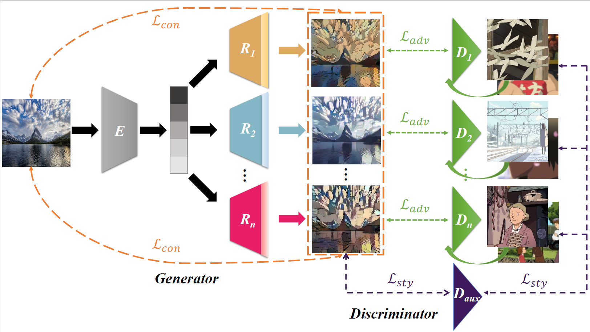

# Multi-Style Photo Cartoonization
Pytorch implement of Yezhi Shu, Ran Yi, Mengfei Xia, Zipeng Ye, Wang Zhao, Yang Chen, Yu-Kun Lai, Yong-Jin Liu. GAN-based Multi-Style Photo Cartoonization. IEEE Transactions on Visualization and Computer Graphics, DOI (identifier) 10.1109/TVCG.2021.3067201, 2021.

## Our Proposed Framework


## Results


# Installation
Install PyTorch 1.2.0+ and torchvision from http://pytorch.org and other dependencies could be downloaded by
```bash
pip install -r requirements.txt
```
# Train
- Prepare your own dataset and put it under the dataset folder. Note that your own dataset should contain subfoloders: train0, train1_[style1name], train2_[style2name], ..., edge1_[style1name], edge2_[style2name], ..., test0. Different style names corresponding to different styles you have collected.
- Download the vgg19.pth from BaiduYun (https://pan.baidu.com/s/1zHx06jMfIUIdBY_X3ko6LA, extract code is z9p7) or Googledrive (https://drive.google.com/drive/folders/1jOSl_sBpGzm1wAvLgU5vDJOV9tg2PzIc?usp=sharing). Put it under Multi-Style Photo Cartoonization folder.
- Train the model using the commond. Set --init to use initialization phase. If you have pretrained model, you can set --continue_train and --which_epoch simultaneously.
```bash
python train.py --init --name train --dataroot [your dataset path]
```

# Test
- You can use your own trained model to test the model, also you can download pretrained models by the link below.
- Put test real-world photo in test0 folder of your dataset.
```bash
python test.py --name train --serial_test --dataroot [your dataset path] --which_epoch 145
```


# Citation

# Reference code
- CycleGAN (https://github.com/junyanz/pytorch-CycleGAN-and-pix2pix)
- CartoonGAN (https://github.com/FlyingGoblin/CartoonGAN)
- ComboGAN (https://github.com/AAnoosheh/ComboGAN)
